# জাভাস্ক্রিপ্টের জন্য এনভায়রনমেন্ট সেটাপ

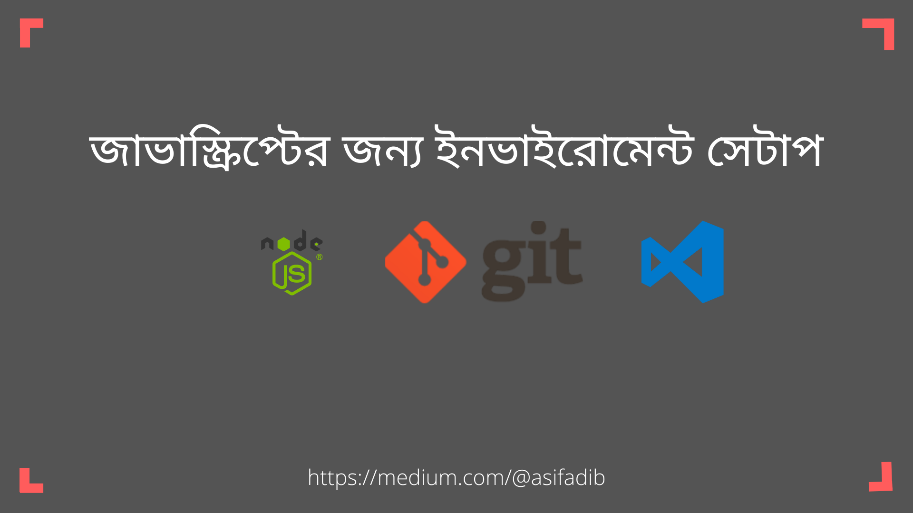

যেকোনো প্রোগ্রামিং ভাষা নিয়ে কাজ করতে হলে তার একটা এনভায়রনমেন্ট সেটাপ করার দরকার হয় । একটা কম্পাইলার একটা টেক্সট ইডিটর অনেক গুলো টুলস একসাথে করে একটা এনভায়রনমেন্ট সেটাপ করার দরকার হয় তারপরে গিয়েই একটা কোড রান করতে পারবেন । যেকোনো প্রোগ্রামিং ভাষার ক্ষেত্রেই এই কথাটা প্রযোজ্য । তবে জাভাস্ক্রিপ্ট এর ক্ষেত্রে বেপারটা খুবই সহজ আপনার পিসিতে একটা ব্রাউজার আর টেক্সট ইডিটর হলেই জাভাস্ক্রিপ্ট কোড রান করা যায়। আর এভাবেই এতোদিন সবাই জাভাস্ক্রিপ্ট কোড সবাই রান করে এসেছে ২০১৫ এর আগে পর্যন্ত।

২০১৫ সালে যখন জাভাস্ক্রিপ্ট এর নতুন ভার্সন মার্কেটে আসলো তখন অবশ্যই অনেক কিছু পরিবর্তন হয়ে গিয়ছে জাভাস্ক্রিপ্টের ওয়ার্কফ্লো টা পরিবর্তন হয়ে গিয়েছে অনেক নতুন নতুন ফিচার চলে এসেছে তখন আর বেসিক ভাবে এইচটি এম এল পেইজের সাহায্যে জাভাস্ক্রিপ্ট ফাইলকে লিংক আপ করে ব্রাউজারের মাধ্যমে ওপেন করে কোড রান করার সিস্টেমটা পরিবর্তন হয়ে গিয়েছে , এটা এখনো অনেকে ব্যবহার করে কিন্তু মডার্ন জাভাস্ক্রিপ্ট এভাবে চলে না। **নোড** **জে** **এস** চলে আসাতে এখন আর জাভাস্ক্রিপ্ট কোড রান করার জন্য ব্রাউজার ও প্রয়োজন হয়না । অন্যান্য প্রোগ্রামিং ভাষার এর মতই কম্পাইলার ইন্সটল করে টার্মিনালে কোড লিখে কোডটা রান করবেন জাভাস্ক্রিপ্টের ক্ষেত্রে এইটা সত্য ছিলোনা কিন্তু **নোড** **জে** **এস** চলে আসার পর জাভাস্ক্রিপ্টের জন্য ও এটা সত্য হয়ে গেছে।

**নোট:** আপনি চাইলে এইচটি এম এল ফাইলের সাথে লিংক করে ও জাভাস্ক্রিপ্ট কোড ব্রাউজারের কনসোলে রান করতে পারবেন এবং শিখতে পাড়বেন

কিন্তু আমরা এই সিরিজে জাভাস্ক্রিপ্টকে এমন ভাবে শিখবো ফ্রন্ট ইন্ড এ যেভাবে কাজে লাগে জাভাস্ক্রিপ্ট, ব্যাক ইন্ড এ ও সেভাবে কাজে লাগে, মোবাইল এপ্লিকেশনেও সেভাবে কাজে লাগে এই রকম একটা মনোভাব নিয়ে আমরা জাভাস্ক্রিপ্ট শিখবো । আগের টিউটোরিয়াল গুলো দেখলে বুঝা যায় না ফ্রন্ট ইন্ড এবং ডোম ম্যানুপুলেশন ছাড়া আর কোন কাজে লাগে জাভাস্ক্রিপ্ট। আমরা এমন ভাবে জাভাস্ক্রিপ্ট শিখতে যাচ্ছি যে, আপনারা যেনো বুঝতে পারেন জাভাস্ক্রিপ্ট এখন একটা মাল্টি পারপাস প্রোগ্রামিং ভাষা এবং হাই লেভেল প্রোগ্রামিং ভাষা।

**চলুন** **আর** **কথা** **না** **বারিয়ে** **এনভায়রনমেন্ট** **সেটাপ** **শুরু** **করা** **যাক**

১। প্রথমে আমরা নোড জে এস ইন্সটল করবো। নোড জে এস ডাউনলোড করার জন্য এই সাইটে ভিসিট করুন [**Node.Js**](https://nodejs.org/en/), ভিসিট করার পর এল টি এস ভার্সনটা আপনার পিসিতে ডাউনলোড করে নিন।

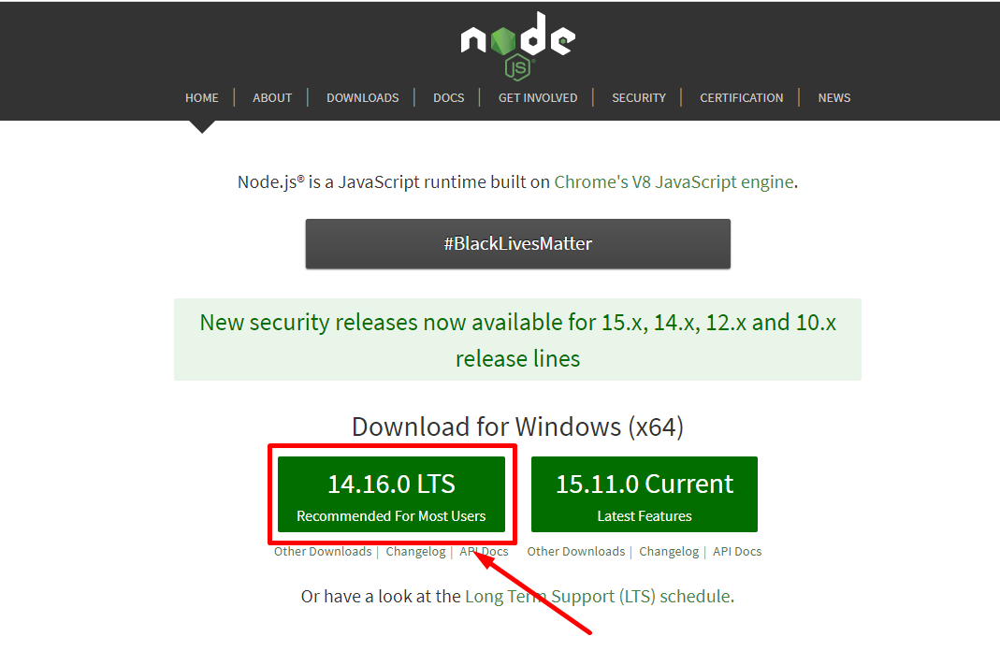

তারপর অন্যান্য সফটওয়্যার যেভাবে ইন্সটল করেন **নোড** **জে** **এস** ও সেভাবেই ইন্সটল করে নেন।

২। কোড লিখার জন্য আমাদের একটা টেক্সট ইডিটর লাগবে। আমার পছন্দের টেক্সট ইডিটর হলো Visual Studio Code. আমি VS Code এইটাই ব্যবহার করবো এইটা ফ্রি এবং খুবই ভালো এবং পাওয়ারফুল একটা টেক্সট ইডিটর। আপনি চাইলে আপনার পছন্দ অনুযায়ি ডাউনলোড করে নিতে পারেন।

VS Code ডাউনলোড করার জন্য এই সাইটে ভিসিট করুন [**Visual Studio Code**](https://code.visualstudio.com/)। ভিসিট করার পর স্টেবল ভার্সনটা আপনার পিসিতে ডাউনলোড করে নিন।

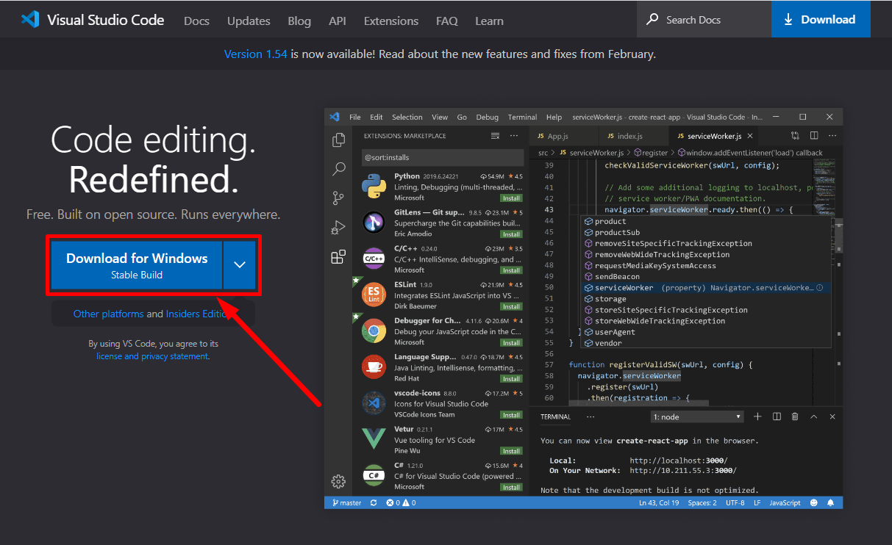

তারপর অন্যান্য সফটওয়্যার যেভাবে ইন্সটল করেন Visual Studio Code ও সেভাবেই ইন্সটল করে নেন।

৩। টেক্সট ইডিটর এর পর আমাদের লাগবে টার্মিনাল। আমি যেহেতু অপারেটিং সিস্টেম হিসেবে উইন্ডোজ ব্যবহার করবো তাই লিনাক্সের সকল কমান্ড রান করার জন্য আমি টার্মিনাল হিসাবে গিট ব্যাস ইন্সটল করে নিবো

Git Bash ডাউনলোড করার জন্য এই সাইটে ভিসিট করুন [**Git Bash**](https://git-scm.com/)। ভিসিট করার পর স্টেবল ভার্সনটা আপনার পিসিতে ডাউনলোড করে নিন।

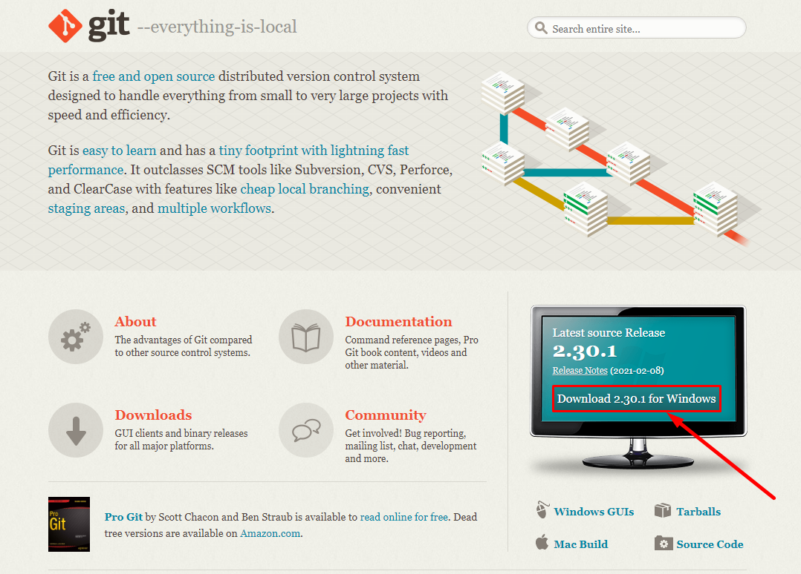

তারপর অন্যান্য সফটওয়্যার যেভাবে ইন্সটল করেন Git Bash ও সেভাবেই ইন্সটল করে নেন।

উপরের সব কিছু ইন্সটল করা হয়ে গেলে প্রথমে টার্মিনালটা চালু করবেন। টার্মিনাল চালু করার জন্য ডেক্সটপের মাঝে মাউসের রাইট বাটনে ক্লিক করবেন নিচের মতো অপশন আসবে

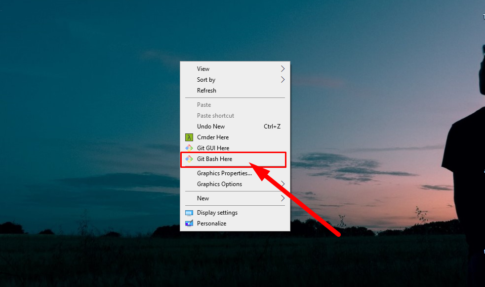

তারপর Git Bash Here এর মাঝে ক্লিক করবেন নিচের মতো টার্মিনাল স্ক্রিন চালু হবে।

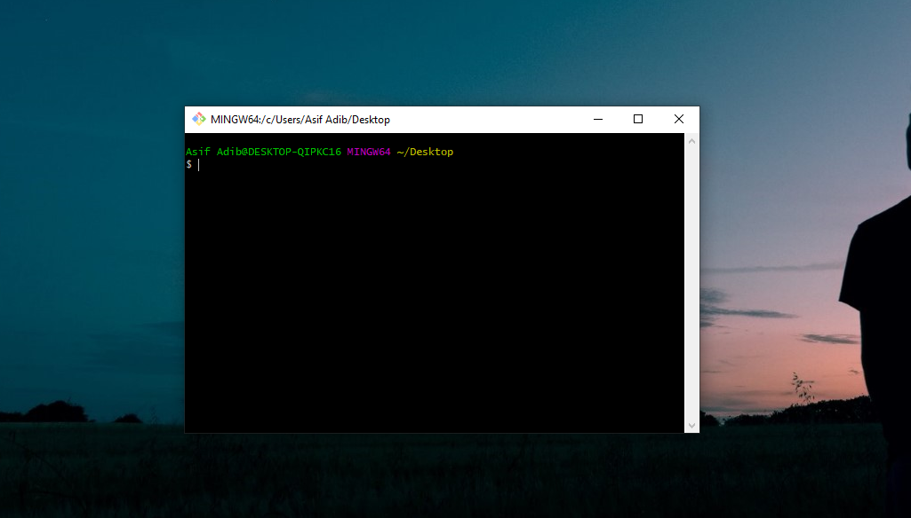

টার্মিনাল চালু করার পর সবকিছু ঠিকঠাক ভাবে হয়েছে কিনা তা দেখার জন্য টার্মিনালে **`node -v`** এই কমান্ডটা লিখে ইন্টার দিবেন নিচের ছবির মতো করে।

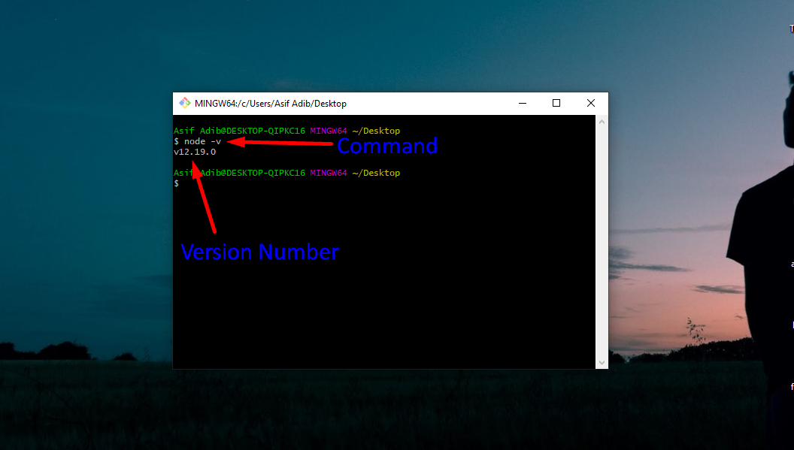

Node -v এই কমান্ডটা রান করার পর যদি দেখেন টার্মিনালে ভার্সন নাম্বারটা দেখাচ্ছে তার মানে সব ঠিকঠাক ভাবেই ইন্সটল হয়েছে।

তারপর আর একটা জিনিস চেক করবেন **নোড** **জে** **এস** এর সাথে একটা **NPM** বান্ডেলার দেয় তা ঠিক আছে কিনা তা দেখার জন্য **`npm -v`** এই কমান্ডটা লিখে ইন্টার দিবেন নিচের ছবির মতো করে।

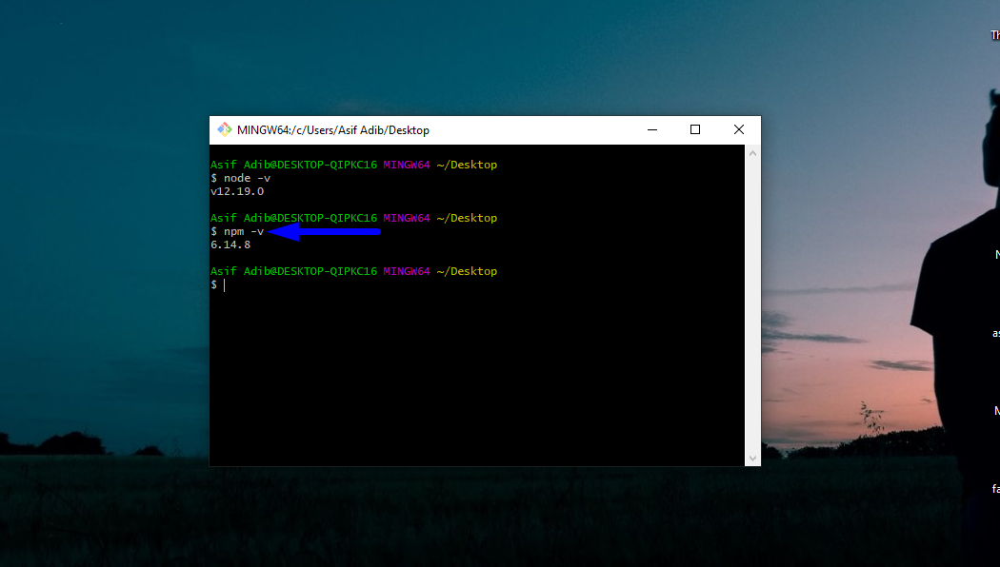

Npm -v এই কমান্ডটা দেয়ার পর যদি দেখেন ভার্সন নাম্বারটা টার্মিনালে দেখাচ্ছে তার মানে সব ঠিকঠাক ভাবেই ইন্সটল হয়েছে। তারমানে এখন আমাদের পিসি রেডি হয়ে গিয়েছে জাভাস্ক্রিপ্ট কোড লিখে রান করার জন্য।

চলুন তাহলে এবার একটা জাভাস্ক্রিপ্ট কোড রান করে দেখি কোড রান করার জন্য প্রথমে টার্মিনালে **`node`** লিখে কমান্ড দিতে হবে তারপর জাভাস্ক্রিপ্ট কোড রান করার জন্য প্রস্তুত হয়ে যাবে টার্মিনাল। যেকোনো জাভাস্ক্রিপ্ট কোড এখানে ভ্যালিড কোড।

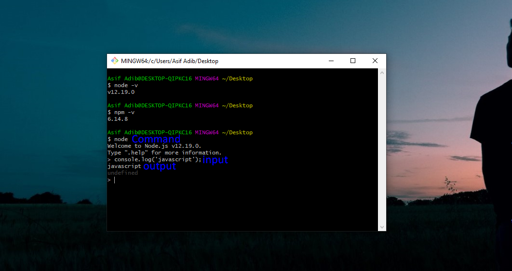

এখানে জাভাস্ক্রিপ্ট কোড রান করা পর ব্রাউজারে যেভাবে আউটপুট দেখাতো ঠিক সেভাবেই আউটপুট দেখাচ্ছে। জাভাস্ক্রিপ্ট নিয়ে কাজ করার জন্য এই হচ্ছে এনভায়রনমেন্ট সেটাপ।

**বিদ্রঃ** উপরের কোড না বুঝলেও কোন সমস্যা নেই। পরবর্তী চ্যাপ্টার হতে আমরা হাতেকলমে জাভাস্ক্রিপ্ট শিখা শুরু করবো।

**`node`** কমান্ড দেয়ার পর তা থেকে বের হতে **`.exit`** এই কমান্ডটি ব্যবহার করবো নিচের মতো করে।

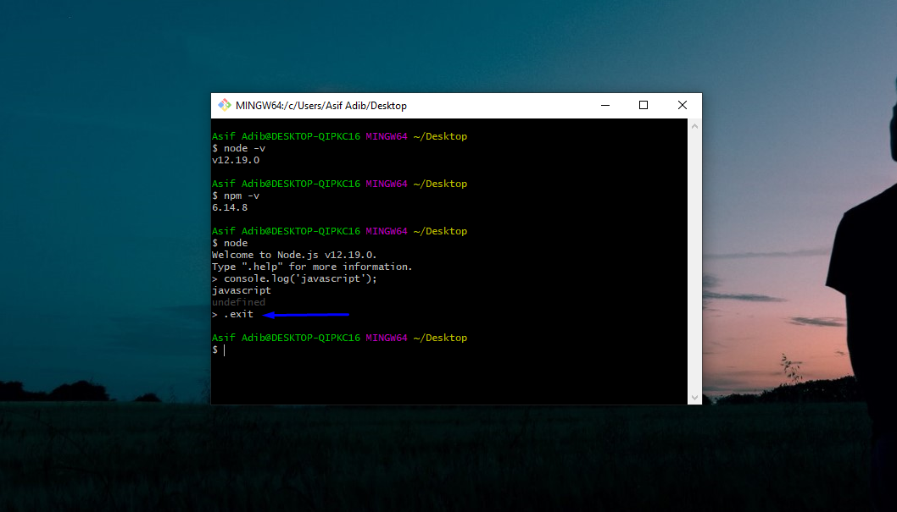

আমরা জাভাস্ক্রিপ্ট শিখার মাঝে মাঝে টার্মিনালের কিছু কমান্ডও শিখবো।  আজকে আমরা যে কমান্ডটা শিখবো তা হলো কিভাবে টার্মিনালের স্ক্রিন ক্লিয়ার করতে হয়। তারজন্য আমাদের **`clear`** কমান্ডটা দিতে হবে। নিচে দেখানো হলো

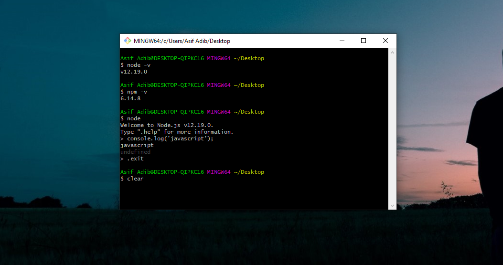

তাহলেই টার্মিনালের স্ক্রিন ক্লিয়ার হয়ে যাবে নিচের দেখানো ছবির মতো।

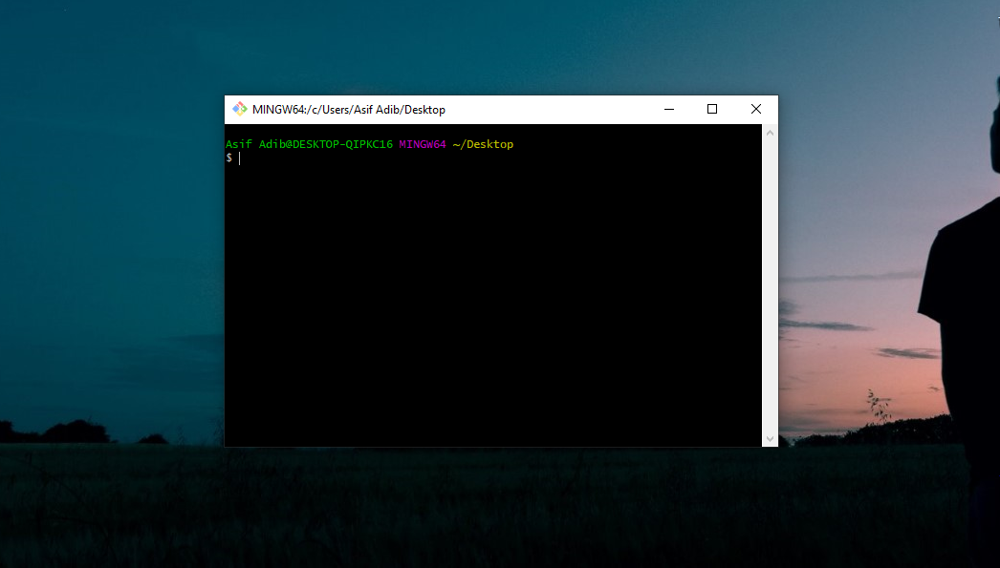

**আমাদের** [**জাভাস্ক্রিপ্ট ফেইসবুক ডিসকাশন গ্রুপে**](https://web.facebook.com/groups/javascript.journey/) যুক্ত হতে চাইলে জয়েন করতে পাড়েন। এই গ্রুপে আমারা জাভাস্ক্রিপ্ট রিলেটেড আলোচনা করে থাকি।

যাই হোক, অনেক কথা হলো। আশা করি, জাভাস্ক্রিপ্টের জন্য **এনভায়রনমেন্ট** **সেটাপ** **কিভাবে করে** সেটা বোঝাতে পেরেছি। তারপরও যদি বুঝতে কোনো অসুবিধা হয় বা কোনো প্রশ্ন থাকে তাহলে নিচে কমেন্টে জানাতে পারেন।

আজ এ পর্যন্তই। ধন্যবাদ

**হ্যাপি কোডিং!** 😍 😍 

