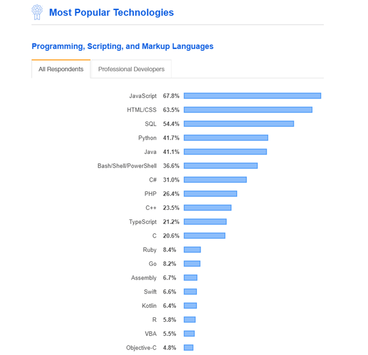

# জাভাস্ক্রিপ্ট সম্পর্কে প্রাথমিক ধারনা

জাভাস্ক্রিপ্ট বিশ্বের অন্যতম জনপ্রিয় প্রোগ্রামিং ভাষা। আমি বিশ্বাস করি এটি আপনার প্রথম প্রোগ্রামিং ভাষা হবার জন্য উপযুক্ত প্রোগ্রামিং ভাষা হতে পারে। কারন জাভাস্ক্রিপ্টের রয়েছে সবচেয়ে বড়ো প্রোগ্রামিং কমিউনিটি যা একটি প্রোগ্রামিং ভাষা শিখতে খুবই সহায়ক ভূমিকা রাখে।

জাভাস্ক্রিপ্ট এখন একটা মাল্টি পারপাস ও হাই লেভেল প্রোগ্রামিং ভাষা। ওয়েব এর জন্য নাম্বার ওয়ান প্রোগ্রামিং ভাষা হচ্ছে বর্তমানে [জাভাস্ক্রিপ্ট](https://www.geeksforgeeks.org/top-10-programming-languages-that-will-rule-in-2021/)।

## **জাভাস্ক্রিপ্ট** **কি?**

জাভাস্ক্রিপ্ট সংক্ষেপে JS বলা হয়।  _**জাভাস্ক্রিপ্ট একটি প্রোগ্রামিং ভাষা যা হলো:**_

**হাই লেভেলঃ** জাভাস্ক্রিপ্টকে হাই লেভেল প্রোগ্রামিং ভাষা বলা হয়। হাই লেভেল প্রোগ্রামিং ভাষা মানে কি? 

একটা উদাহরণের সাহায্যে বুঝতে চেষ্টা করি চলুন। আপনাকে আপনার মেশিন সম্পর্কে খুব বেশী জানতে হবেনা। যেমন সি ইউজ করতে গেলে আপনাকে মেশিন কিভাবে কাজ করে , কিভাবে কোড কম্পাইল করে , কিভাবে কোড রান করে , মেমোরি কতোটুকু নিবে এগুলা নিয়ে ভাবতে হয়। কিন্তু হাই লেভেল প্রোগ্রামিং ভাষাতে এতো কিছু ভাবার প্রয়োজন হয়না। এখানে ল্যাঙ্গুয়েজই আপনার হয়ে অনেক কাজ করে দিবে। এতে যেমন সুবিধা ও রয়েছে তেমনি অসুবিধাও রয়েছে। সুবিধা ও অসুবিধা এগুলো নিয়ে আমরা পরে বিস্তারিত আলোচনা করবো।

**ডায়নামিকঃ**   

**ডায়নামিকালি টাইপডঃ**  

**লোসলি টাইপডঃ**  

**জাস্ট ইন টাইম কম্পাইলঃ** 

**ইন্টারপ্রেটেডঃ** 

**মাল্টি প্যারাডাইমঃ** 

### **জাভাস্ক্রিপ্টের** **ইতিহাস**

১৯৯৫ সালে নেটস্কেপের প্রকৌশলী Brendan Eich জাভাস্ক্রিপ্ট তৈরি করেন, যেটা মুক্তি পায় ১৯৯৬ সালের প্রথমদিকে নেটস্কেপ ২ \(ব্রাউজার\) এর সাথে। এর নাম করা হয়েছিল LiveScript, কিন্তু মার্কেটিং কৌশলের গ্যাড়াকলে পড়ে দুর্ভাগ্যজনত এর নাম জাভাস্ক্রিপ্ট হয়ে যায়, সান মাইক্রোসিস্টেম এর জাভা ল্যাংগুয়েজের জনপ্রিয়তাকে পুঁজি করার জন্য। জাভা আর জাভাস্ক্রিপ্টের মাঝে তেমন কোন ধরেণের মিল না থাকা সত্ত্বেও সেই থেকে এখনো জাভাস্ক্রিপ্ট নামটা নিয়ে বিভ্রান্তি রয়ে গেছে । আরো বিস্তারিত জানতে এখানে দেখুন [_Wikipedia_](https://bn.wikipedia.org/wiki/%E0%A6%9C%E0%A6%BE%E0%A6%AD%E0%A6%BE%E0%A6%B8%E0%A7%8D%E0%A6%95%E0%A7%8D%E0%A6%B0%E0%A6%BF%E0%A6%AA%E0%A7%8D%E0%A6%9F)

জাভাস্ক্রিপ্টের ইতিহাসটা কিছুটা মজার। ১৯৯৫ সালে নেটস্কেপ কমিউনিকেশন নামের এক কোম্পানি ব্র্যান্ডন এইখ নামের এক কম্পিউটার প্রকৌশলীকে দায়িত্ব দেয় তাদের ব্রাউজারে ব্যবহারের জন্য একটি প্রোগ্রামিং ভাষা তৈরি করতে। ব্রাউজারটির নাম ছিলো নেটস্কেপ নেভিগেটর, যা পরবর্তীতে ফায়ারফক্সে রূপান্তরিত হয়। ব্র্যান্ডন এইখ তার কাজ শুরু করার আগেই নেটস্কেপ সান মাইক্রোসিস্টেমের সাথে আলোচনা করে ঠিক করে নেয় তাদের ব্রাউজারে সানের জাভা প্রোগ্রামিং ভাষাটি ব্যবহার করার। এর কারণ ছিলো তখনকার সেরা প্রোগ্রামিং ভাষা জাভা ব্যবহার করে সেরা ব্রাউজার নির্মাতা মাইক্রসফটের সাথে পাল্লা দেয়া।

তাই তারা সিদ্ধান্ত নেয় তাদের নির্মিত ভাষা দেখতে জাভার মতো হবে; তখনকার অন্যান্য প্রোগ্রামিং ভাষা পার্ল, পাইথন কিংবা স্কিমের মতো না। প্রতিযোগীতার দৌড়ে এগিয়ে থাকার জন্য ব্র্যান্ডন এইখ জাভাস্ক্রিপ্টের প্রথম খসরাটি \(প্রোটোটাইপটি\) তৈরি করেন মাত্র ১০ দিনে। মকা নামে এই ভাষাটি নির্মিত হলেও, প্রথম যখন এটি নেটস্কেপ নেভিগেটর ২.০ এ সংযুক্ত হয় তখন এর অফিসিয়াল নাম ছিলো লাইভস্ক্রিপ্ট। পরবর্তীতে নেটস্কেপ নেভিগেটর ৩.০ এ নাম পরিবর্তন করে রাখা হয় জাভাস্ক্রিপ্ট। এই নামটি মানুষের মাঝে বিভ্রান্তি সৃষ্টি করেছিলো। নামের সাথে জাভা থাকায় অনেকে মনে করতো এটি জাভারই একটি অংশ \(যা এখনো অনেকে মনে করেন\)। এটা আসলে ছিলো একটা মার্কেটিং পলিসি। তখনকার সেরা ভাষা জাভার জনপ্রিয়তাকে কাজে লাগানোই ছিলো মূল উদ্দেশ্য।

১৯৯৬ সালে নেটস্কেপ ইকমা ইন্টারন্যাশনালের কাছে জাভাস্ক্রিপ্ট ভাষাটি প্রেরণ করে একটি স্টান্ডার্ড তৈরি করার জন্য। আর এ পথ ধরেই ১৯৯৭ সাথে প্রকাশিত হয় জাভাস্ক্রিপ্টের প্রথম ল্যাঙ্গুয়েজ স্ট্যান্ডার্ড, যার অফিসিয়াল নাম ছিলো ইকমাস্ক্রিপ্ট। ইকমাস্ক্রিপ্ট স্ট্যান্ডার্ডের সবচেয়ে জনপ্রিয় ইমপ্লিমেন্টেশান হচ্ছে আমাদের আলোচ্য জাভাস্ক্রিপ্ট। নানা চড়াই-উতড়াই পেরিয়ে, ধাপে ধাপে পরিবর্তন-পরিবর্ধন হয়ে বর্তমানে ইকমাস্ক্রিপ্ট ভার্শন ৭ এ এসে পৌঁছেছে। আর আমাদের আলোচনাও হবে জাভাস্ক্রিপ্টের সাম্প্রতিক সংস্করণগুলো নিয়ে।

### কোথায় কিভাবে জাভাস্ক্রিপ্ট ব্যবহার করা হয়?

ক্লাইন্ট সাইড

সার্ভার সাইড

লাইটওয়েট

ক্রস প্ল্যাটফর্ম

ওয়েব সার্ভার, ওয়েব আপ্লিকেশন, ক্রস প্লাটফর্ম আপ্লিকেশন ও বানাতে পারবেন। জাভাস্কিপ্ট এখন আল্টিমেট ল্যাঙ্গুয়েজ একের ভিতর সব, এক ল্যাঙ্গুয়েজ দিয়েই সব করতে পারবেন ।

### জাভাস্ক্রিপ্টের জনপ্রিয় কিছু লাইব্রেরি এবং ফ্রেমওয়ার্কসমূহ

> **React Js**
>
> **Angular Js**
>
> **Node Js**
>
> **Electron Js**
>
> **React Native**
>
> **Vue Js**

## **কেন** **জাভাস্ক্রিপ্ট** **শিখবো?**

_জাভাস্ক্রিপ্টের_ _ভবিষ্যৎ:_ নিচের ছবি দেখেই বুঝতে পারছেন জাভাস্ক্রিপ্ট এর কি পরিমান চাহিদা ও জনপ্রিয়তা রয়েছে। স্ট্যাক ওভারফ্লো ডেভেলপার সার্ভে ২০১৯ এর নাম্বার ওয়ান ল্যাংগুয়েজ জাভাস্ক্রিপ্ট নিয়ে আর বেশি কিছু বলতে হবেনা আশাকরি। বিস্তারিত জানতে ক্লিক করুন : [Stack Overflow](https://insights.stackoverflow.com/survey/2019#most-popular-technologies)

### **যা** **যা** **শিখবো** **এই** **টিউটোরিয়াল** **সিরিজে**

আমরা যেভাবে জাভাস্ক্রিপ্টের ব্যাসিক থেকে শুরু করে এডভান্স টপিক গুলো শিখবো নিচে তার একটি ছবি তুলে ধরা হলো

এছাড়াও জাভাস্ক্রিপ্ট ব্যবহারের সুবিধা দিনদিন বাড়ছেই। আজ এতটুকুই।হ্যাপি কোডিং!

কষ্ট করে পড়ার জন্য _**আপনাকে**_ _**ধন্যবাদ,**_ আমি নিজে যা শিখছি তাই সবার সাথে শেয়ার করার উদ্দেশ্যে এই টিউটোরিয়াল সিরিজ লেখা। আমি এই সিরিজ টাতে জাভাস্ক্রিপ্ট এর মূল কনচেপ্ট গুলো আলোচনা করার প্ল্যান করেছি।

আমি একটা ফেইসবুক ডিসকাসন গ্রুপ তৈরি করেছি এই লিংকে গিয়ে জয়েন করতে পারনে [Facebook Group](https://web.facebook.com/groups/javascript.journey/) আমাদের সাথে যুক্ত হতে চাইলে। এই গ্রুপে আমারা জাভাস্ক্রিপ্ট রিলেটেড আলোচনা করে থাকি।

আমার সাথে যুক্ত হতে চাইলে ফলো করেন

[Github](https://github.com/asifadib)

[Facebook](https://web.facebook.com/asifadib.official)

[Linkedin](https://www.linkedin.com/in/asifadib/)

[Twitter](https://twitter.com/asifadib780)

