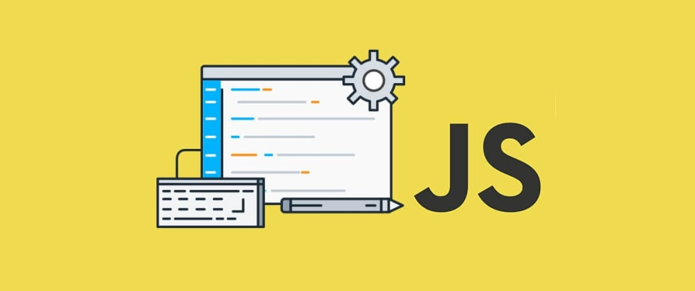

# জাভাস্ক্রিপ্ট সম্পর্কে প্রাথমিক ধারনা

জাভাস্ক্রিপ্ট বিশ্বের অন্যতম জনপ্রিয় প্রোগ্রামিং ভাষা। আমি বিশ্বাস করি এটি আপনার প্রথম প্রোগ্রামিং ভাষা হবার জন্য উপযুক্ত প্রোগ্রামিং ভাষা হতে পারে। কারন জাভাস্ক্রিপ্টের রয়েছে সবচেয়ে বড়ো প্রোগ্রামিং কমিউনিটি যা একটি প্রোগ্রামিং ভাষা শিখতে খুবই সহায়ক ভূমিকা রাখে।

জাভাস্ক্রিপ্ট এখন একটা মাল্টি পারপাস ও হাই লেভেল প্রোগ্রামিং ভাষা। ওয়েব এর জন্য নাম্বার ওয়ান প্রোগ্রামিং ভাষা হচ্ছে বর্তমানে [জাভাস্ক্রিপ্ট](https://www.geeksforgeeks.org/top-10-programming-languages-that-will-rule-in-2021/)।

## **জাভাস্ক্রিপ্ট** **কি?**

জাভাস্ক্রিপ্ট হচ্ছে একটি **হাই লেভেল,** **ইন্টারপ্রেটেড, ডায়নামিক, জাস্ট ইন টাইম কম্পাইল, মাল্টি প্যারাডাইম ও ফাংশনাল** প্রোগ্রামিং ভাষা।

জাভাস্ক্রিপ্টকে সংক্ষেপে **JS** বলা হয়।

**হাই লেভেলঃ** জাভাস্ক্রিপ্টকে হাই লেভেল প্রোগ্রামিং ভাষা বলা হয়। হাই লেভেল প্রোগ্রামিং ভাষা মানে কি?

একটা উদাহরণের সাহায্যে বুঝতে চেষ্টা করি চলুন। আপনাকে আপনার মেশিন সম্পর্কে খুব বেশী জানতে হবেনা। যেমন **C** ব্যবহার করতে গেলে আপনাকে মেশিন কিভাবে কাজ করে, কিভাবে কোড কম্পাইল করে, কিভাবে কোড রান করে, মেমোরি কতোটুকু নিবে এগুলা নিয়ে ভাবতে হয়। কিন্তু হাই লেভেল প্রোগ্রামিং ভাষাতে এতো কিছু ভাবার প্রয়োজন হয়না। এখানে ল্যাঙ্গুয়েজই আপনার হয়ে অনেক কাজ করে দিবে। এতে যেমন অনেক সুবিধা ও রয়েছে তেমনি অসুবিধাও রয়েছে। সুবিধা ও অসুবিধা এগুলো নিয়ে আমরা পরে বিস্তারিত আলোচনা করবো।

### **জাভাস্ক্রিপ্টের** **ইতিহাস**

জাভাস্ক্রিপ্টের ইতিহাসটা অনেক মজার। ১৯৯৫ সালে নেটস্কেপের প্রকৌশলী [**Brendan Eich**](https://en.wikipedia.org/wiki/Brendan_Eich) মাত্র ১০ দিনে **মকা** নামে প্রথম খসড়াটি নির্মাণ করা হলেও প্রথম যখন এটি ১৯৯৬ সালের শুরুরদিকে নেটস্কেপ নেভিগেটর ২.০ ভ্রাউজারে সংযুক্ত করা হয় তখন এর অফিসিয়াল নাম করণ করা হয়েছিল **লাইভস্ক্রিপ্ট**।

কিন্তু পরবর্তীতে মার্কেটিং কৌশলের গ্যাড়াকলে পড়ে দুর্ভাগ্যজনত এর নাম জাভাস্ক্রিপ্ট হয়ে যায়। সান মাইক্রোসিস্টেম এর জাভা ল্যাংগুয়েজের জনপ্রিয়তাকে পুঁজি করার জন্য। নেটস্কেপ নেভিগেটর ৩.০ ভ্রাউজারে নাম পরিবর্তন করে রাখা হয় **জাভাস্ক্রিপ্ট।**

**জাভা** আর __**জাভাস্ক্রিপ্টের** মাঝে তেমন কোন ধরেণের মিল না থাকা সত্ত্বেও সেই থেকে এখনো জাভাস্ক্রিপ্ট নামটা নিয়ে বিভ্রান্তি রয়ে গেছে ।

নেটস্কেপ ১৯৯৬ সালে জাভাস্ক্রিপ্ট ইঞ্জিন চালু করে **Spider Monkey** নামে যা এখনো মজিলা ফায়ারফক্স ভ্রাইজারে ব্যবহার করা হয়। জাভাস্ক্রিপ্ট পাবলিকালি রিলিস করার পর।

১৯৯৬ সালে নেটস্কেপ ইকমা ইন্টারন্যাশনালের কাছে জাভাস্ক্রিপ্ট ভাষাটি নিয়ে যায় একটি স্টান্ডার্ড তৈরি করার জন্য। ১৯৯৭ সালে প্রকাশিত হয় জাভাস্ক্রিপ্টের প্রথম ল্যাঙ্গুয়েজ স্ট্যান্ডার্ড, ট্রেডমার্ক সমস্যার কারণে জাভাস্ক্রিপ্টের নাম পরিবর্তন করে অফিসিয়াল নাম করণ করা হয়েছিল ইকমাস্ক্রিপ্ট। মূলত ইকমাস্ক্রিপ্ট আর জাভাস্ক্রিপ্ট একই বিষয়। ১৯৯৮ সালে ইকমাস্ক্রিপ্ট এর ২য় ভার্সন রিলিজ হয়।

১৯৯৯ সালে ES3 বাজারে আসে যা জাভাস্ক্রিপ্টের ইতিহাসকে পরিবর্তন করে ফেলে ES3 এর মাঝে অনেক নতুন নতুন ফিচার নিয়ে আসে যা পাবলিকালি অনেক জনপ্রিয়তা পায়। ইকমাস্ক্রিপ্ট ৩ এর সফলতার পর ইকমাস্ক্রিপ্ট ৪ ডেভেলপ করা হলে এটি জটিলতার কারনে ব্যার্থ হয়। পরবর্তীতে ইকমাস্ক্রিপ্ট ৫ তৈরি করার সময় ES4 পুরোপুরি এড়িয়ে গিয়ে ইকমাস্ক্রিপ্ট ৩ কে মেইন ধরে ২০০৮ সাল থেকে শুরু করে ২০১৪ সালে ES5 রিলিজ করা হয়। ES5 অনেক সফলতা অর্জন করে।

আর এভাবেই জাভাস্ক্রিপ্ট নানা চড়াই-উতড়াই পেরিয়ে, ধাপে ধাপে পরিবর্তন পরিবর্ধন হয়ে বর্তমানে ইকমাস্ক্রিপ্ট ভার্শন ১১ তে এসে পৌঁছেছে।

আরো বিস্তারিত জানতে এখানে দেখুন [_Wikipedia_](https://en.wikipedia.org/wiki/ECMAScript)

### কোথায় কিভাবে জাভাস্ক্রিপ্ট ব্যবহার করা হয়?

যদি আমাকে প্রশ্ন করেন জাভাস্ক্রিপ্ট কি কাজে লাগে? তাহলে আমার উত্তর হবে  > JavaScript is Everywhere!!

ওয়েবসাইট, ওয়েব আপ্লিকেশন, ওয়েব সার্ভার, মোবাইল আপ্লিকেশন, ডেক্সটপ আপ্লিকেশন, ক্রস প্ল্যাটফর্ম, মাইক্রোকন্ট্রোলার, ইন্টারনেট অফ থিংস যেটাই করতে চান না কেনো, জাভাস্ক্রিপ্ট এখন সব খানেই বস। আমার সাথে দ্বিমত পোষণ করতেই পারেন। তবে জাভাস্ক্রিপ্টের এর থেকে বড় পরিসরে আর কোনটিই বাজারে নেই, আপনাকে সেটা মানতেই হবে। জাভাস্ক্রিপ্টের অনেক অনেক কাজের ক্ষেত্র যেমন আছে, তেমনি রয়েছে অসংখ্য লাইব্রেরী, ফ্রেময়ার্ক। আপনি কোনো চিন্তা ছাড়াই জাভাস্ক্রিপ্ট শিখায় মনোযোগ দিতে পারেন।

জাভাস্ক্রিপ্ট দিয়ে আপনি যেকোনো কিছুই তৈরি করতে পারবেন অন্যান্য প্রোগ্রামিং ভাষার মতো।

জাভাস্কিপ্ট এখন আল্টিমেট ল্যাঙ্গুয়েজ হয়ে দাঁড়িয়েছে একের ভিতর সব, এক ল্যাঙ্গুয়েজ দিয়েই সব করতে পারবেন।

### জাভাস্ক্রিপ্টের জনপ্রিয় কিছু লাইব্রেরি এবং ফ্রেমওয়ার্কসমূহ

| **ফ্রন্ট-এন্ড ডেভেলপমেন্টঃ** | **ব্যাক-এন্ড ডেভেলপমেন্টঃ** | **আপ্লিকেশন ডেভেলপমেন্টঃ** |
| :--- | :--- | :--- |
| **React Js** | **Node Js** | **React Native** |
| Angular Js | Express Js | Ionic |
| Vue Js | Koa Js | Electron Js |
| Svelte Js | Deno | Next Js |

## **কেন** **জাভাস্ক্রিপ্ট** **শিখবো?**

_জাভাস্ক্রিপ্টের_ _ভবিষ্যৎ:_ নিচের ছবি দেখেই বুঝতে পারছেন জাভাস্ক্রিপ্ট এর কি পরিমান চাহিদা ও জনপ্রিয়তা রয়েছে। স্ট্যাক ওভারফ্লো ডেভেলপার সার্ভে ২০২০ এর নাম্বার ওয়ান ল্যাংগুয়েজ জাভাস্ক্রিপ্ট নিয়ে আর বেশি কিছু বলতে হবেনা আশাকরি। বিস্তারিত জানতে ক্লিক করুন : [Stack Overflow](https://insights.stackoverflow.com/survey/2020#technology-programming-scripting-and-markup-languages)

### **যা** **যা** **শিখবো** **এই** **টিউটোরিয়াল** **সিরিজে**

আমি এই সিরিজ টাতে জাভাস্ক্রিপ্ট এর মূল বিষয়গুলো আলোচনা করার প্ল্যান করেছি। আমরা জাভাস্ক্রিপ্টের ব্যাসিক থেকে শুরু করে এডভান্স টপিক গুলো এই টিউটোরিয়াল সিরিজে শিখবো।

কষ্ট করে পড়ার জন্য _**আপনাকে**_ _**ধন্যবাদ,**_ আমি নিজে যা শিখছি তাই সবার সাথে শেয়ার করার উদ্দেশ্যে এই টিউটোরিয়াল সিরিজ লেখা।

আমি একটা ফেইসবুক ডিসকাসন গ্রুপ তৈরি করেছি। এই লিংকে গিয়ে জয়েন করতে পারনে [Facebook Group](https://web.facebook.com/groups/javascript.journey/) এ আমাদের সাথে যুক্ত হতে চাইলে। এই গ্রুপে আমারা জাভাস্ক্রিপ্ট রিলেটেড আলোচনা করে থাকি।

আজ এতটুকুই। হ্যাপি কোডিং!

আমার সাথে যুক্ত হতে চাইলে ফলো করেন

[Github](https://github.com/asifadib) । [Facebook](https://web.facebook.com/asifadib.official) \| [Linkedin](https://www.linkedin.com/in/asifadib/) \| [Twitter](https://twitter.com/asifadib780)

